# Industrial Safety Monitoring CAN Network

A two-node CAN bus safety system built on STM32, demonstrating embedded safety patterns used in automotive and industrial control: message integrity (CRC, counters), heartbeat/watchdog monitoring, and deterministic safe-state transitions. Python-based CAN traffic logger included for analysis.

**Project status:** 🚧 In progress — Week 1 of 3

## Goals

- Build a working two-node CAN safety network on real hardware
- Demonstrate AUTOSAR-flavoured patterns (DEM-like diagnostics, COM-like validation, WdgM-like watchdog) in plain HAL code
- Produce quantitative timing analysis with a Python logger
- Document the build day-by-day as a learning record

## Hardware

- 2× STM32 Nucleo-F446RE
- 2× SN65HVD230 CAN transceivers
- 1× BME280 temperature/humidity sensor (I2C)
- 1× SG90 servo motor
- 1× Innomaker USB-CAN adapter for PC-side logging
- 120 Ω termination resistors, breadboard, jumper wires

## Repository structure
Industrial Safety Monitoring CAN Network/
├── blink_test/         # Day 1–2: toolchain validation, LED blink, UART printf
├── images/             # screenshots and hardware photos, organised by day
└── ...                 # (more sub-projects added as work progresses)

## Build log

### Week 1 — STM32 basics, I2C sensor, UART debugging

#### Day 1 (2026-05-13) — Toolchain setup and LED blink

Validated the STM32CubeMX → STM32CubeIDE workflow on a Nucleo-F446RE. Used Board Selector to generate a baseline project — this pre-configures the system clock, PA5 (user LED LD2), PC13 (user button B1), and routes USART2 (PA2/PA3) to the ST-Link virtual COM port. Configured the code generator to emit one `.c/.h` file per peripheral (cleaner than the default single-file dump) and to preserve user code between `/* USER CODE BEGIN ... */` markers on regeneration.

Implemented LED blink three ways to internalise the abstraction layers:
- `HAL_GPIO_TogglePin(LD2_GPIO_Port, LD2_Pin)` — HAL wrapper, function call
- `GPIOA->ODR ^= GPIO_ODR_OD5` — CMSIS read-modify-write
- `GPIOA->BSRR = GPIO_BSRR_BS5` — CMSIS atomic single-cycle write (preferred for ISR safety)

Covered why the BSRR pattern matters once interrupts share a GPIO port with the main loop — a foundation for the multi-LED status indicators planned for Node A.

  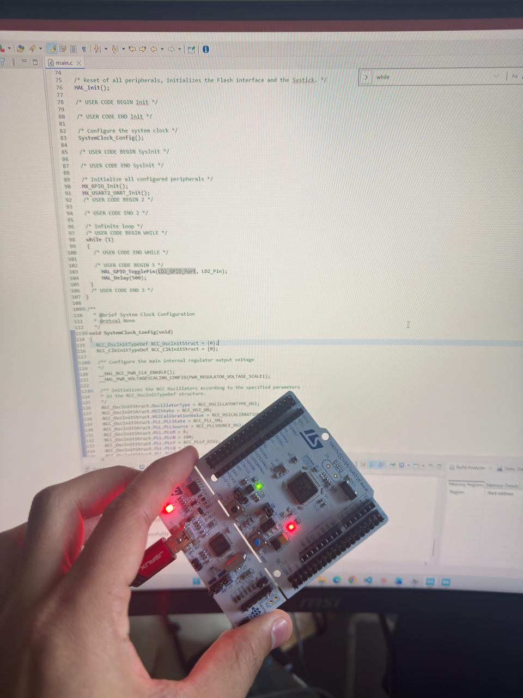
   
  <em>First firmware running on hardware — green LD2 blinking at 1 Hz on the Nucleo-F446RE.</em>

Setup screenshots

  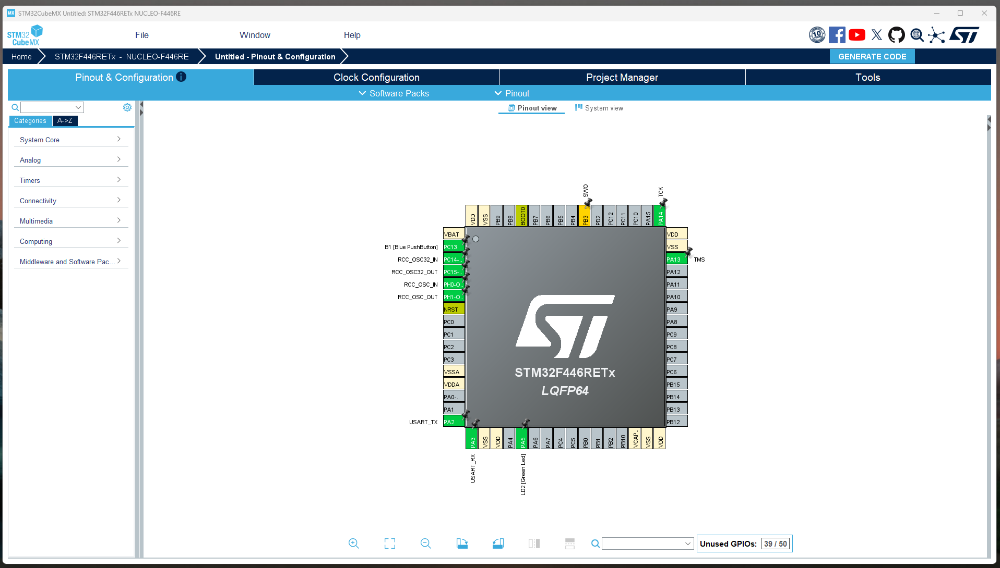
   
  <em>CubeMX Board Selector pinout view — PA5 (LD2), PA2/PA3 (USART2), PC13 (B1) pre-configured.</em>

  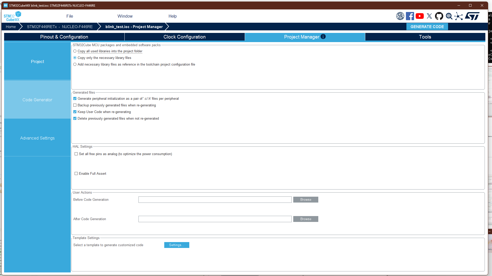
   
  <em>Code Generator settings — per-peripheral file split and user-code preservation enabled.</em>

  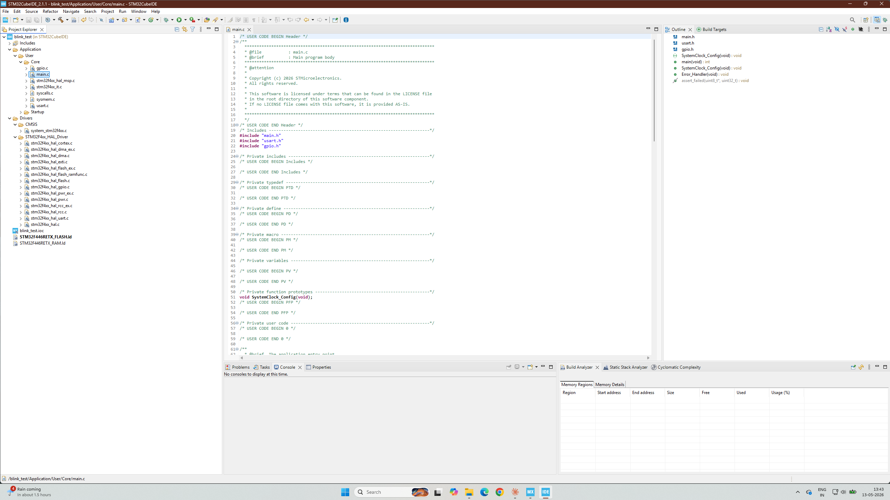
   
  <em>Generated project structure in STM32CubeIDE.</em>

#### Day 2 (2026-05-14) — UART printf debugging via ST-Link virtual COM port

Retargeted stdout to USART2 (115200 8N1) by overriding the `_write()` syscall to forward bytes through `HAL_UART_Transmit`. The Nucleo's onboard ST-Link MCU also acts as a USB-to-serial bridge, so no extra hardware is required for the PC to see the output. Boot banner includes `__DATE__`/`__TIME__` compiler macros — a sanity check that the firmware currently running matches the most recent build.

Implemented an in-line `printf` profiler using `HAL_GetTick()` before and after each print call.

**Measurements:**
- Boot-to-first-output: ~5 ms (clock-tree stabilisation + boot banner transmission)
- Each printf at 115200 baud: ~2–3 ms, dominated by serial transmit time (each character ≈87 µs on the wire; `HAL_UART_Transmit` blocks until the last byte has left)
- Nominal 500 ms `HAL_Delay` loop drifts to 503–505 ms once printing is added — the observer effect on timing

This is the first quantitative observation of how blocking I/O distorts deterministic scheduling — directly motivates the FreeRTOS-vs-bare-metal comparison planned for Project 3.

  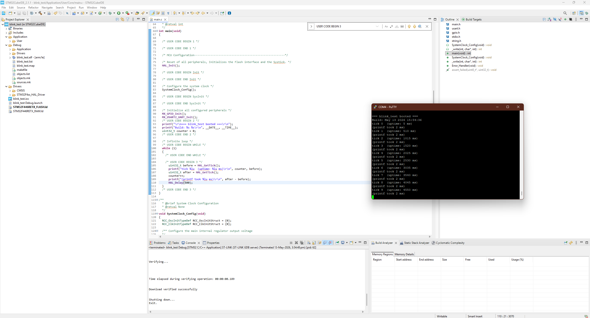
   
  <em>Live UART output in PuTTY showing tick counter, system uptime, and self-measured printf duration.</em>

Setup and earlier iteration

  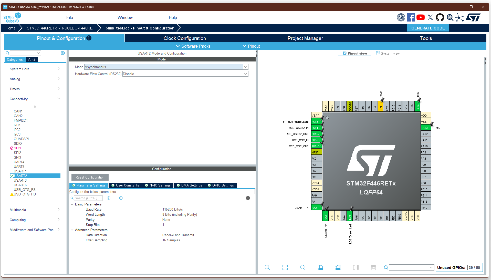
   
  <em>USART2 configuration in CubeMX: 115200 8N1, hardware flow control disabled.</em>

  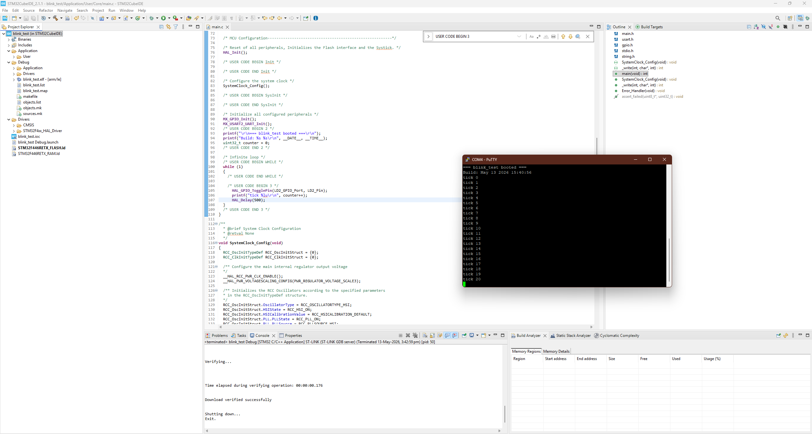
   
  <em>First working UART output — boot banner plus tick counter (before adding uptime/profiling).</em>

#### Day 3 (2026-05-15) — I2C bus and BME280 sensor discovery

Enabled I2C1 peripheral on PB8 (SCL) and PB9 (SDA) at 100 kHz Standard Mode via CubeMX. Validated the regeneration workflow: reopened the `.ioc`, enabled a new peripheral, regenerated code, and confirmed that previously-written user code inside `/* USER CODE BEGIN ... */` markers survived intact — this is the workflow that scales as the project grows.

Wired a BME280 temperature/humidity/pressure sensor breakout to the Nucleo's Arduino-compatible header (VIN → 3V3, GND → GND, SCL → D15/PB8, SDA → D14/PB9). Implemented two operations at boot:

1. **I2C bus scanner** — iterates all 127 possible 7-bit addresses, calling `HAL_I2C_IsDeviceReady` on each. Any address that ACKs gets printed.
2. **Chip ID verification** — once a device is found, reads register `0xD0` via `HAL_I2C_Mem_Read`. The BME280 datasheet guarantees this register returns `0x60`. Matching value confirms not just I2C connectivity, but that the correct sensor type is on the bus (vs. e.g. the older BMP280 which returns `0x58`).

Covered the HAL address-shifting convention (`<< 1` to make space for the read/write bit) — the most common single source of "I2C silently doesn't work" bugs in STM32 code.

  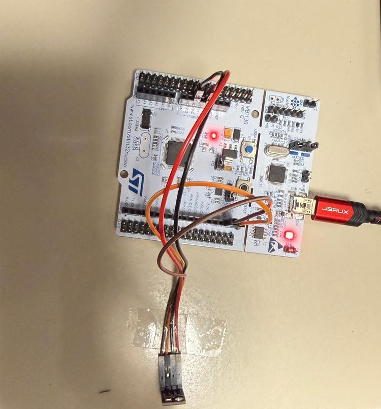
   
  <em>BME280 sensor wired to the Nucleo over I2C — VIN, GND, SCL, SDA on the Arduino-compatible header.</em>

  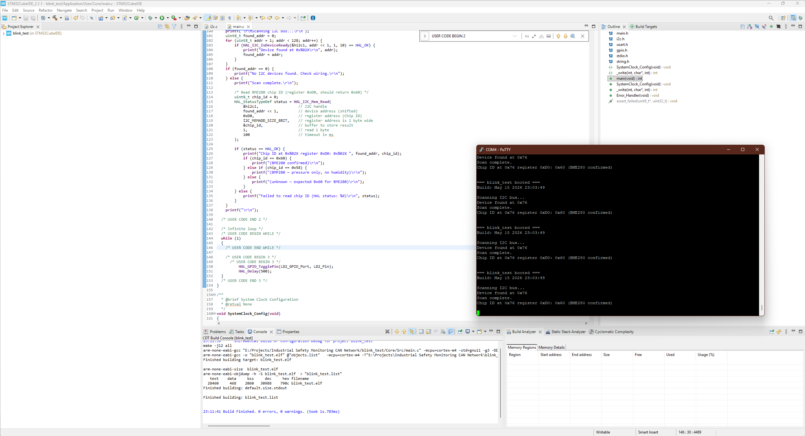
   
  <em>Boot output: I2C scanner finds the sensor at 0x76; chip ID read at register 0xD0 returns 0x60, confirming the device is a genuine BME280.</em>

CubeMX I2C configuration

  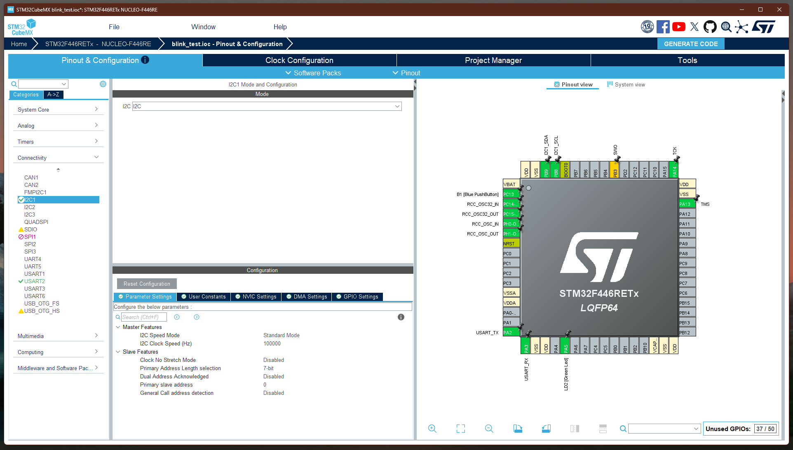
   
  <em>I2C1 peripheral configured: Standard Mode, 100 kHz, 7-bit addressing. PB8/PB9 auto-routed as SCL/SDA.</em>

#### Day 4 (2026-05-17) — Live temperature, humidity, and pressure readings

Extended the BME280 work from chip-ID discovery to full sensor operation. Created dedicated driver files (`bme280.h` / `bme280.c`) to keep `main.c` focused on application logic — the structural pattern used in production embedded code.

Implementation steps:
1. **Read 26 bytes of calibration data** from registers `0x88..0xA1` and another 7 bytes from `0xE1..0xE7` at init. Each BME280 chip is factory-calibrated; these coefficients are unique per device and must be read from the chip's non-volatile memory.
2. **Configure measurement mode** — wrote `0xF2 = 0x01` (humidity oversampling ×1), `0xF4 = 0x27` (temp ×1, pressure ×1, normal continuous mode), `0xF5 = 0xA0` (1000 ms standby, filter off).
3. **Read 8 bytes of raw measurement** from `0xF7..0xFE` every second — 20-bit raw values for pressure, temperature, and humidity in a single I2C transaction.
4. **Apply Bosch's compensation algorithm** (datasheet section 4.2.3) — converts raw ADC values plus calibration coefficients into real-world units (°C, %RH, hPa). The math uses `int32_t` and `int64_t` intermediates with careful sign handling; copied verbatim from the official reference driver.

**Live readings confirm:** temperature ~28 °C (sensor self-heats ~2 °C above ambient), humidity ~65% RH, pressure ~998 hPa (consistent with Friedberg elevation). Breathing on the sensor pushes humidity above 80% within two samples, validating that real environmental coupling works.

  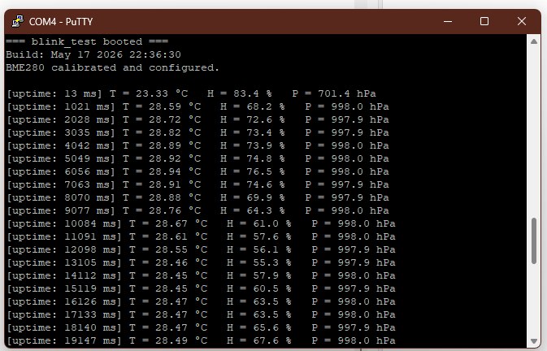
   
  <em>Continuous BME280 readings — temperature, humidity, and pressure printed every second over UART.</em>

Driver files and validation

  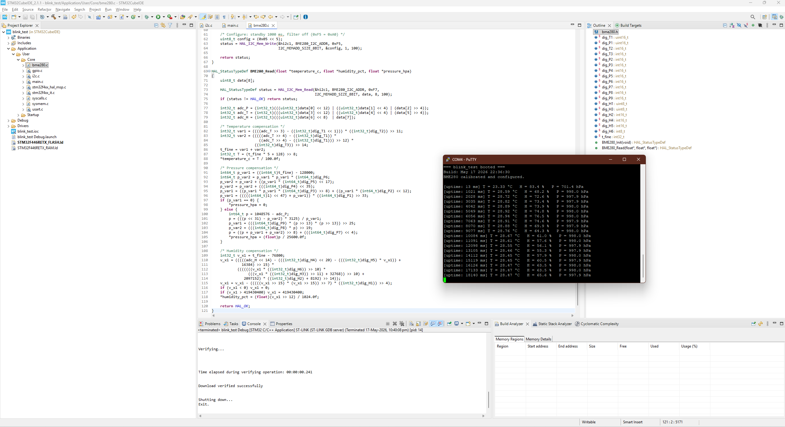
   
  <em>BME280 driver (<code>bme280.c</code>) showing the algorithm, with live readings in PuTTY confirming the math produces valid real-world values.</em>

## Skills demonstrated

*(this section grows as work progresses)*

- I2C bus protocol: 7-bit addressing, master-slave model, bus scanning, register-based sensor protocols
- Sensor integration: BME280 wiring (I2C + 3.3V power), chip ID verification, factory calibration data handling
- Driver architecture: separated sensor code into `bme280.h` / `bme280.c` for modularity
- Fixed-point compensation math: `int32_t` / `int64_t` arithmetic per Bosch datasheet specification
- Float-formatted printf output via `-u _printf_float` linker flag

## Author

Swayam Jakhalekar — M.Sc. Control, Computer and Communications Engineering
Technische Hochschule Mittelhessen, Friedberg